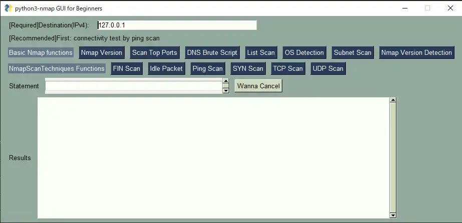

# python3-nmap_GUI_for_Beginners
## Summary
Use nmap library in GUI and Python(You must install "PySimpleGUI" and "python3-nmap" via pip)  

## Image

## Note
[info]When you use python-nmap3, you must install nmap at any OS in advance.  
[info] Some functions(udp_scan, os_detection,subnet_scan) must run with root privilege at the same case of the Nmap.

## References
#About PySimpleGUI: https://github.com/PySimpleGUI/PySimpleGUI  
#About python3-nmap: https://pypi.org/project/python3-nmap/  
#About Nmap: https://nmap.org/download.html  
